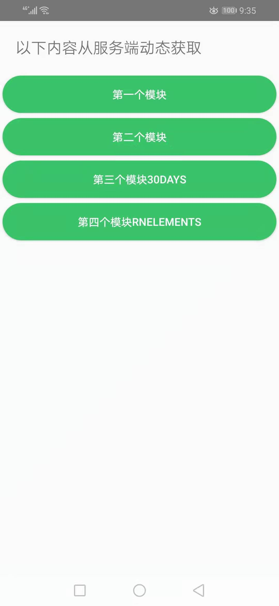
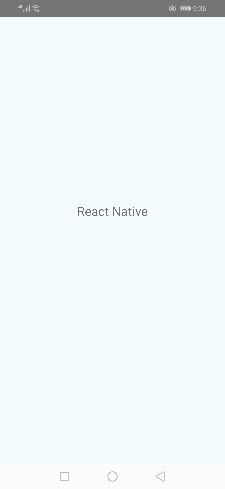
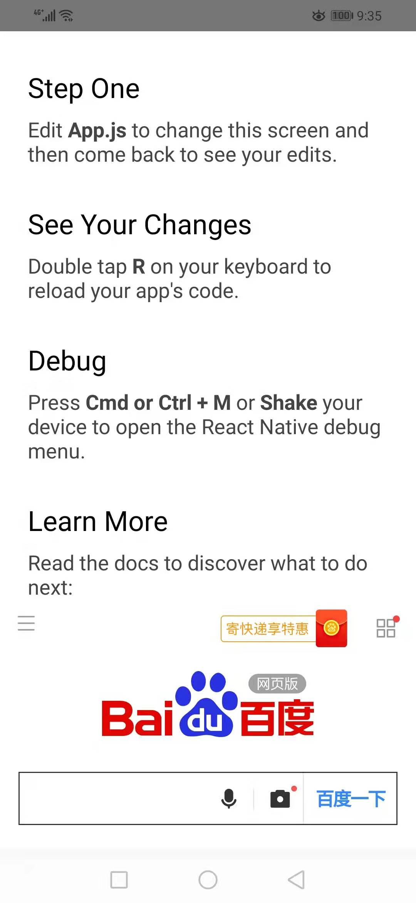

**## 0. 目录说明

- **AwesomeProject** 主项目
- **rn-server**  Server
- **bundles**    模块压缩包
- **AModel**     A模块
- **BModel**     B模块
- **RNElements** react native elements ui库测试项目
- **~~host~~ **    原主项目代码

## 1. 创建项目

### 1.1 初始项目 

`npx react-native init ThirtyDaysOfReactNative`

### 1.2 安装依赖

`yarn install #npm install -g yarn` 

### 1.3  打包模块

`npx react-native bundle --entry-file index.js --bundle-output ./ThirtyDaysOfReactNative/ThirtyDaysOfReactNative.bundle --platform android --assets-dest ./bundle --dev false`

### 1.4  测试代码
`npx react-native run-android`

`npx react-native run-android --variant=release` 

### 1.5 截图

**首页**

**AModel**

**ThirtyDays**

**RNElements**
